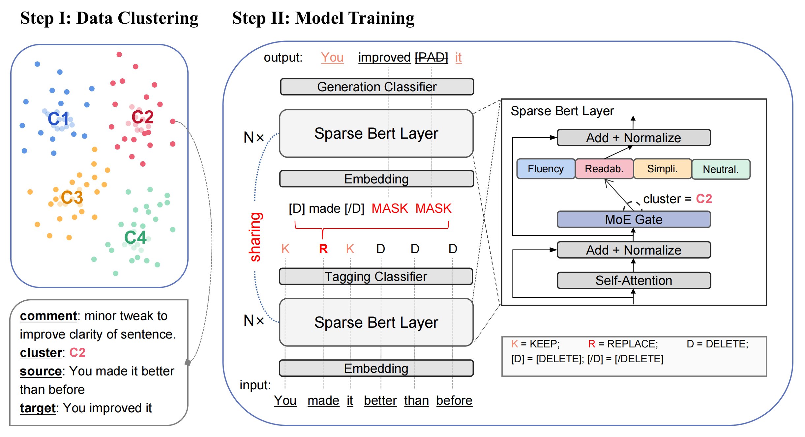

# G-SPEED
The official repository of paper [G-SPEED: General SParse Efficient Editing MoDel](https://arxiv.org/abs/2310.10480) (Findings of EMNLP-2023).



## Set up enviroment
### Clone this repository
```bash
git clone https://github.com/Banner-Z/G-SPEED.git
cd G-SPEED
```
### Create a conda env
```bash
conda create -n gspeed
conda activate gspeed
```
Alternatively, we supply a `requirements.txt` file; which can be used to create a conda environment by `pip install -r requirements.txt`.

The necessary environments for G-SPEED include: `torch, transformers, datasets, evaluate, and accelerate`. You can build an environment that includes these packages to get started quickly.

If you want to perform data clustering yourself, you need to install [cuml](https://docs.rapids.ai/install), sklearn, and sentence_transformers. In addition, we use [EditEval](https://github.com/facebookresearch/EditEval) for evaluation. If you need to perform evaluation, you can refer to their method.

## G-SPEED Training and Evaluation

### Step 0: Download the dataset or collect it from scratch.
Our dataste is available at https://huggingface.co/datasets/zhk/wiki-edits.
Each piece of data includes three attributes: 'source', 'target', and 'intent'. There are a total of 506k pieces of data, including four intents: "Readability", "Neutralization", "Fluency", "Simplification".

If you need to obtain new clustering data, you can collect wikipedia editing history according to [this](./wiki_collector/README.md), and then cluster the data according to [this](./data_cluster/README.md).

### Step 1: Annotate editing actions using dynamic programming.
We use dynamic programming to obtain the minimum editing distance to label the editing action for each <souce, target> pair. Here is a demo:

```python
# Dynamic programming
cd dp_edit_action
python utils/preprocess_data.py \
    -s demo_source.txt \
    -t demo_target.txt \
    -o diff.txt

# Convert data format
cd ../src
python convert_data2json.py \
    -i ../dp_edit_action/diff.txt \
    -o train-tagging.json \
    --mode tagging
python convert_data2json.py \
    -i ../dp_edit_action/diff.txt \
    -o train-generation.json \
    --mode generation
```

### Step 2: Pre-training and additional fine-tuning.
Our model is available at https://huggingface.co/zhk/G-SPEED. It has six experts: fluency, clarity, coherence, paraphrasing, simplification, neutralization (these six experts correspond to task num from 0 to 5, which will be used during inference).

Here is an example with pre-training and additional fine-tuning:
```
cd src
bash train_mt.sh
bash addi_finetune.sh
```
You need to modify some parameters in the bash files, such as the training set path.

### Step 3: Inference and evaluation.
In the inference phase, you need to generate a `tagging.json` file based on source and target like step 1 (you can also directly use source and source to generate a file full of 'keep' operations). Then use this file as input and make predictions according to `test_mt.sh`.
```
cd src
bash test_mt.sh
```
You need to refer to EditEval first to evaluate the results. In addition, we write a shell file that predicts and evaluates multiple data sets simultaneously:
```
cd src
bash auto_test_mt.sh
```
## Citation
```
@article{zhang2023g,
  title={G-SPEED: General SParse Efficient Editing MoDel},
  author={Zhang, Haoke and Wang, Yue and Li, Juntao and Zhou, Xiabing and Zhang, Min},
  journal={arXiv preprint arXiv:2310.10480},
  year={2023}
}
```
